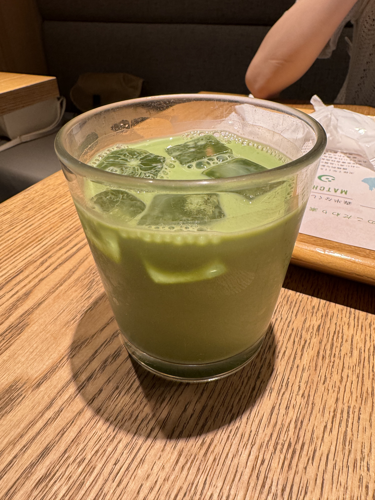

# Osaka Itinerary: June 1-7, 2024

## Overview

This document details my travel itinerary focusing on the city of Osaka, capturing my experiences from June 1st to 7th, 2024.

## Day 1: Arrival in Osaka

- **Morning:** Departure from Hong Kong.
- **Late Afternoon:** Arrival at Kansai International Airport.
- **Evening:**
  - After settling in, we took a walk to the vibrant Dotonbori (道頓堀) area, famous for its bustling nightlife and iconic Glico running man sign.

  

- Dinner followed our exploration:
  - **Restaurant:** [Unotake Kasu Udon](https://maps.app.goo.gl/ehQa7JZ7b6x37Wvy7?g_st=com.google.maps.preview)
  - **Meal:** Enjoyed a hearty bowl of Fried Tofu Udon, accompanied by oolong tea. The udon was exceptionally flavorful, and the tea perfectly complemented the meal, making it a delightful dining experience.

  

## Day 2: Universal Studios Japan (USJ)

- **Full Day:**
  - Spend the day at USJ, enjoying thrilling rides and attractions, including the Super Nintendo World. This section of the park brings the world of Nintendo to life, offering a surreal experience.

  

  
  
  - **Highlight:** At one of the game booths, we tried our hand at a coin throwing game where the objective was to land a coin on a plate.
  - **Victory:** My sister won a big Snoopy stuffed toy, adding a special memory to our exciting day.
  
  

- **Evening:**
  - **Dinner:** After exploring USJ, we waited for about an hour at [花丸軒 難波・法善寺店](https://maps.app.goo.gl/n1sF8c2zTZLsunzB6?g_st=com.google.maps.preview). Around midnight, we enjoyed a delightful meal of ramen, beer, and fried dumplings.

  

## Day 3: Shrines and Nara

- **Morning:**
  - We started our day visiting two shrines in Osaka: Nanba Shrine (難波神社), which is conveniently located just across the street from our hotel, and Namba Yasaka Shrine (難波八阪神社), which is particularly iconic.

  

  

- **Afternoon:**
  - After the shrine visits, we took a train to Nara.
  
  
  
  - Upon arriving at Nara, we were greeted by the famous Nara deer. 🦌
  - We bought a pack of deer cookies to feed them. These deer are so polite that they bow to ask for more cookies!
  
  

  

- **Evening:**
  - After a day filled with historical sights and nature, we had dinner at [北極星 LUCUA大阪店](https://maps.app.goo.gl/TGg97jw1iTwLRQyc6?g_st=com.google.maps.preview), where we enjoyed delicious omurice.

  

## Day 4: Visit to Himeji Castle (姫路城) and Evening in Osaka

- **Morning:** Depart to Himeji by train.

- **Tour the Himeji Castle**:
  - **View from Outside the Station**: Right from the station exit, we captured our first glimpse of the majestic Himeji Castle from afar.
  
  
  
  - **Closer Look**: We purchased tickets to get a closer look at the beautiful castle.
  
  
  
  - **Inside the Castle**: Inside, the historical ambiance and structural designs were mesmerizing.

  

- **Afternoon:**
  - **Return to Osaka**: After exploring Himeji Castle, we headed back to Osaka.
  - **Visit to Cat Cafe**: We visited the [Shelter Cat & VEGAN Café ‘neu’](https://maps.app.goo.gl/eukWdimaxKGR5MgV9?g_st=com.google.maps.preview), a cozy spot where we relaxed with friendly cats.

  

- **Evening:**
  - **Dinner at [酒解](https://maps.app.goo.gl/kjZeLW1y7rauJNFk6?g_st=com.google.maps.preview)**: Ended the day with dinner at a local izakaya, where the menu was only in Japanese and handwritten. We had fun guessing and ordering, which turned out to be a unique and enjoyable experience. The food and beer were excellent. We savored delicious sashimi, enjoyed some freshly fried fish, and sipped on good beer, rounding off the meal perfectly.

  

## Day 5: Exploring Kyoto

- **Morning:**
  - **Travel to Kyoto:** We took the train from Osaka to Kyoto early in the morning.
  - **Lunch at [京うなわ本店](https://maps.app.goo.gl/dQxqijGj153VH6bs9?g_st=com.google.maps.preview)**: Enjoyed a delicious Unadon lunch.

  

- **Day Activities:**
  - **Visit Inabado (平等寺因幡堂):** Explored the serene and historical Inabado. This shrine holds a special place for pet lovers, particularly known for its dedication to pets' well-being. Here, visitors often acquire the famous 六猫御守「无病守」, a charm believed to protect cats and ensure their health.

  
  
  - **Nijo Castle (二条城):** Took a tour of the impressive Nijo Castle.
  
  
  
  - **Matcha Dessert at [茶寮翠泉 高辻本店](https://maps.app.goo.gl/HRuoPmJZkfLDJn64A?g_st=com.google.maps.preview):** Stopped for some exquisite matcha desserts in the afternoon.
  
  

  
  
  - **Kyoto Pokemon Center:** Ended the afternoon with a visit to the Kyoto Pokemon Center for some fun.
  
  

- **Evening:**
  - **Dinner at [Sou](https://maps.app.goo.gl/PbXqaoLaTHu3sSYo6?g_st=com.google.maps.preview)**: Concluded our day with a delightful dinner at Sou, a local izakaya, where we had some tempura, fried oysters, fried chicken, and a croquette.

  

## Day 6: Kyoto Landmarks

- **Morning:**
  - **Visit to Fushimi Inari Taisha (伏見稲荷大社)**: Started our day with a visit to one of Kyoto's most iconic shrines, known for its thousands of vermilion torii gates. Here, I received my first Goshuincho (御朱印帳), a special book for collecting Goshuin (御朱印).

  

  

- **Afternoon:**
  - **Visit to Yasaka Shrine (八坂神社)**: After exploring Fushimi Inari, we visited Yasaka Shrine, another important cultural site in Kyoto. I received my first Goshuin here, marking a special memory of our journey through Kyoto's spiritual heritage.
  
  
  
  

  - **Explore the Historic Slopes**: Before visiting Kiyomizu-dera (清水寺), we explored the charming paths of 一年坂, 二年坂, and 三年坂. These streets are lined with shops selling a variety of unique items, perfect for browsing and shopping.

  
  
  - **Matcha Latte Break**: Enjoyed a refreshing matcha latte at a local cafe, surrounded by the historic surroundings.

  
  
  - **Kiyomizu-dera (清水寺)**: Continued to Kiyomizu-dera.

  

  
  
  - **Art in Action**: Captured the sight of an elderly man skillfully drawing the Sanjunoto (三重塔).
  
  

- **Evening:**
  - **Return to Osaka**: We took the train back to Osaka in the evening.

## Day 7: Osaka and Sukiyaki

- **Morning:**
  - **Visit to Tsuyuten Shrine (露天神社)**: We started our day with a visit to Tsuyuten Shrine. This shrine is marked by a tragic story of lovers who chose to end their lives here, similar to the tale of 'Romeo and Juliet'.

  

  

- **Afternoon:**
  - **Sukiyaki Lunch at [Harijuu (はり重 道頓堀本店)](https://maps.app.goo.gl/7jtV1Kb8B37hT9MJ6?g_st=com.google.maps.preview)**: Enjoyed a delicious sukiyaki lunch at Harijuu, renowned for its high-quality beef. The meal was a delightful treat, costing about 10,000 yen per person.

  

  

  - **Visit to Imamiya Ebisu Shrine (今宮戎神社)**: After lunch, I visited the Imamiya Ebisu Shrine.

  

  

- **Evening:**
  - **Journey to Tokyo:** Took the Shinkansen to Tokyo. Enjoyed a bento on the way.
  
  
  
  

  - Arrived at Tokyo Station at night.
  
  
